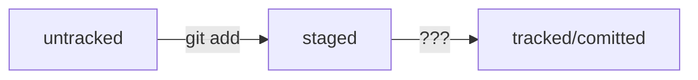

*git init* - инициализировать проект<br>
*git status* - проверка состояния гита:<br>



*git add* - добавление файлов которые хотим отправить на сервер(предварительное действие)<br>
*git push* - отправляем свои файлы/изменения на сервер<br>
*git pull* - подтягиваем актуальные изменения с сервера (в случае если работаете в команде)<br>
*git remote -v* - проверка репозитория (куда смотрит гит)<br>
*git remote set-url origin* - выставляем адрес до проекта(gitlab,github,bitbucket)<br>
*git commit* - делаем файлы отслеживаемым/сохраняем изменения<br>

```mermaid
%% *ОФОРМЛЕНИЕ КОММЕНТАРИЕВ -m* - коментарий, важо делать короткое и информативное сообщение об изменениях<br><br>
```

*git logs* - смотрим логи коммитов<br>
*HEAD* - файл хранит информацию(ссылку) о самом "свежем", последнем коммите и обновляется после каждого коммита<br>
*хеш лога* - это уникальный идентификатор каждого изменения/коммита

